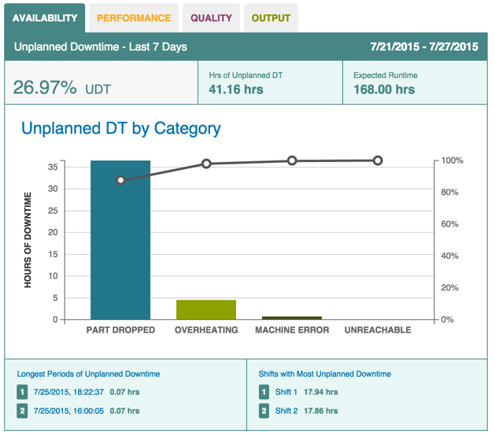

# Downtime Data on the Dashboard \(OEE\) Tab

Machine downtime appears as a Pareto chart on the Dashboard tab's Availability subtab. Use the following steps to refine and view downtime metrics from the Dashboard tab.

**Note:** The Availability subtab may be labeled differently than in the image below, and instead have a unique name specific to your organization.

1.  In the Update pane, select a manufacturing site and machine from the site picker.

    

2.  Select a date range from the Date picker.

    

3.  Click Update to apply your selections to the data.
4.  Click the Availability subtab to display the Pareto chart showing Unplanned Downtime by Category as a percentage of longest machine downtime for the time period.

    

    For more details, click:

    -   Any bar or point along the KPI Pareto chart graph to display the Analysis tab with KPI Pareto charting details
    -   The "Longest Periods of Unplanned Downtime" or "Shifts with Most Unplanned Downtime" links \(or the Shift 1 or Shift 2 links\) in the lower split-pane to display the Data tab with more downtime details for machines or shifts with the longest downtime
    -   The date/time links in the lower left split-pane to display the Timeline tab with details about machine cycles for the time periods that machines had the longest downtime

