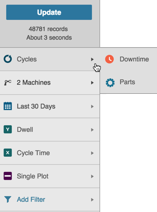
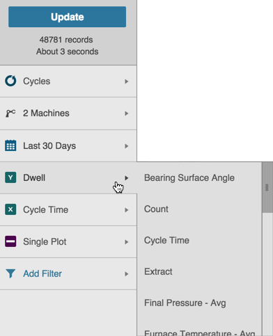
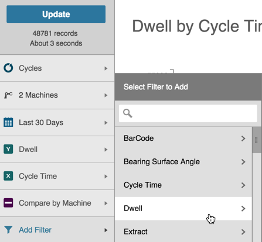

# Building Data Visualization Charts

 Use the following steps as a guide to building Data Visualization charts.
 
 1. Click the Analysis tab.
 2. Select Data Visualization from the Analysis Type drop-down list.
 
    
 
 4. On the Filter Bar, select the type of data you want to review from the Data Type selector (Cycles, Downtime, or Parts).
  
    

 5. Select the asset or assets and date range from the Asset Picker and Date Filter.
 3. Select an option from the Y Axis and X Axis pickers. A pop-out menu displays with available options. Use the slider bar to scroll and see all options. Options may vary based on your configuration. 

    

   4. Select an option from the Comparison Picker: Single Plot, Compare by Factory, or Compare by Machine.
   5. If desired, click Add Filter to display a Filter pop-out menu and select an extra filter. Use the slider bar to see all options.

      

  6. 
