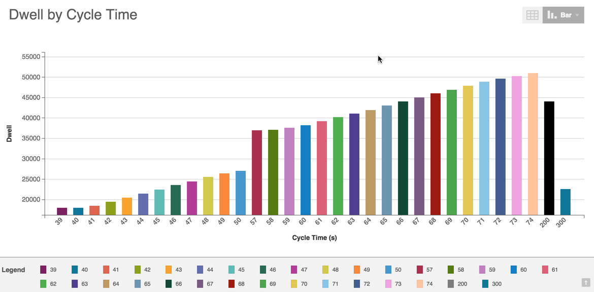

# Building Data Visualization Charts

Use the following steps as a guide to building Data Visualization charts.

1. Click the Analysis tab.
2. Select Data Visualization from the Analysis Type drop-down list.

  

3. On the Filter Bar, select the type of data you want to review from the Data Type selector \(Cycles, Downtime, or Parts\).

  

4. Select the asset or assets and date range from the Asset Picker and Date Filter.

  **Note:** When you select Parts from the Data Type selector, a Part Type option displays in the Filter Bar so you can select parts.

  

5. Select an option from the Y Axis and X Axis pickers. A pop-out menu displays with available options. Use the slider bar to scroll and see all options. Options may vary based on your configuration.

  

6. Select an option from the Comparison Picker: Single Plot, Compare by Factory, or Compare by Machine.

7. If desired, click Add Filter to display a Filter pop-out menu and select an extra filter. Use the slider bar to see all options.

  

  Selecting an option in the pop-out menu displays a sub-pop-out menu where you can enter specific values.

  

  1. Select an operator from the drop-down list.
  2. Enter a value in the associated field.
  3. Click the Add link to save it. This will close the sub-pop-out menu and focus returns to the Filter Bar. Your filter value displays in the Filter Bar above the Add Filter option.

8. Click Update to view the Data Visualization\] chart.

  * The Y axis and X axis labels display. 
  * You can click the Chart Display picker to view the data as a bar chart, line graph, or scatter plot.
  * Line graphs include a legend. 
  * You can hover over any bar,line graph, or scatter point to see pop-up details.
    

**Note:** When you set the Y axis to "Count", the chart will simply count the number of cycles. In this configuration, you also have the option to switch from cycle count to output count. In the example below, the machine produces one pair every two cycles, or 0.5 pairs per cycle, so there are half as many pairs as cycles for a given X axis data item.

**Note:** When you set the Y axis to a _material usage_ data item, the Calculate By drop-down list allows you to switch between averaging that data item per cycle, averaging it per unit output, or totaling it.

If your Data Visualization results return negative numeric values the display adjusts to accomodate it.

