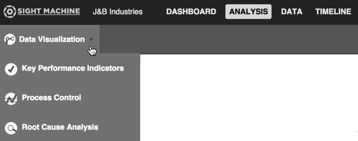

# Building Data Visualization Charts

 Use the following steps as a guide to building Data Visualization charts.
 
 1. Click the Analysis tab.
 2. Select Data Visualization from the Analysis Type drop-down list.
 
    
 
 4. On the Filter Bar, select the asset or assets and date range from the Asset Picker and Date Filter.
 3. Select an option from the Y Axis picker. 
 4. xx