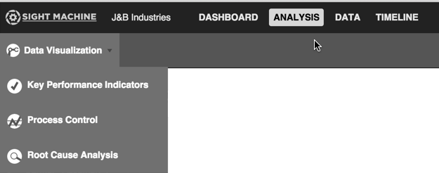
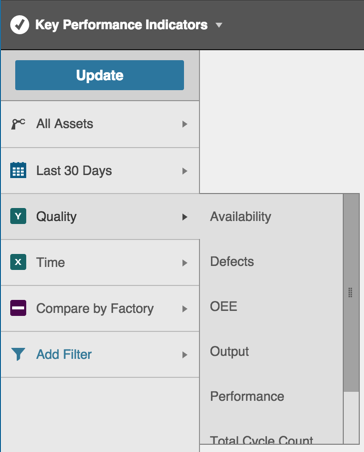
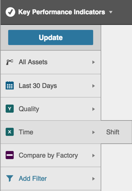
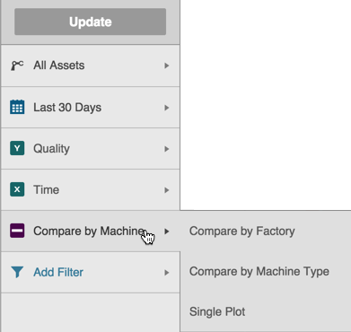
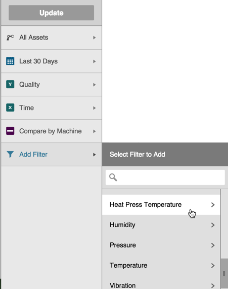
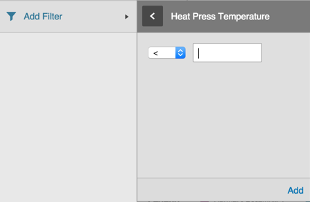
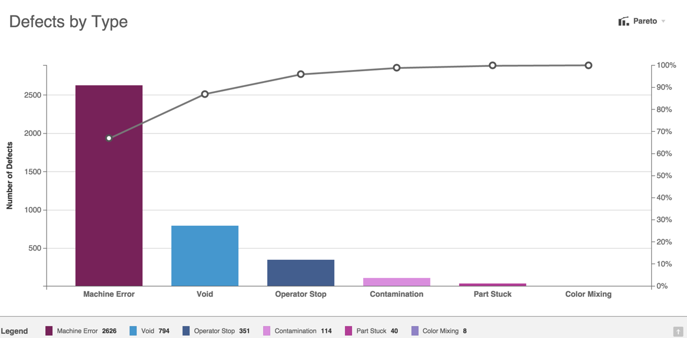

# Building KPI Charts

 Use the following steps as a guide to building KPI charts.
 
 1. Click the Analysis tab.
 2. Select Key Performance Indicators from the Analysis Type drop-down list.

    

 3. On the Filter Bar, select the asset or assets and date range from the Asset Picker and Date Filter.
 4. Select an option from the Y Axis picker. A pop-out menu displays with available options. Use the slider bar to scroll and see all options. Options may vary from the image below, based on your configuration.
 
     
 
 5. Select either Shift or Time from the X Axis picker. Options may vary based on your configuration.

    
 
 
 6. Select an option from the Comparison picker.
  
      
  
 7. If desired, click Add Filter to display a Filter pop-out menu and select an extra filter. Use the slider bar to see all options.

    

    Selecting an option in the pop-out menu displays a sub-pop-out menu where you can enter specific values.

    

     1. Select an operator from the drop-down list.
     2. Enter a value in the associated field.
     3. Click the Add link to save it. This will close the sub-pop-out menu and focus returns to the Filter Bar. Your filter value displays in the Filter Bar above the Add Filter option.

 8. Click Update to view a KPI Pareto chart. The Y axis and X axis labels clearly display, along with a legend. Hover over any bar or line graph point to see pop-up quantity or percentage details.

    

 9. Click any bar or point along the KPI Pareto chart graph to display the Data tab with more detailed information.