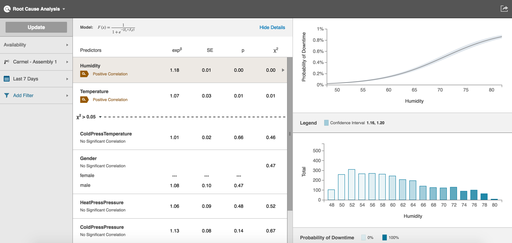

# Building RCA Charts

  Use the following steps to build an RCA chart.
  
  1. Select an option from the Variable Picker (i.e. Availability, Performance, or Qualitly).
  2. Select a machine from the Assett Picker.
  3. Select a date from the Date Filter.
  4. Click the Add Filter Picker to select any added filters.
  5. Click Update to display the charts. Predictor variable correlations are on the left, and on the right, a confidence graph is at the top with a histogram below it.
  **Note:** The confidence graph and histogram display data for the variable selected in the Predictors table. 

 

