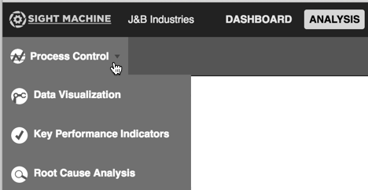

# Building SPC Charts

Use the following steps to build an SPC chart in Sight Machine.

1. From the Analysis tab, select Process Control from the 

  

2. Select an asset from the Asset Picker.

3. Select a variable to analyze from the Parts filter.
4. Select a date filter.
5. Select an extra filter from the Add Filter list, and provide any configurable values.
6. Click Update to apply all filters for the asset and variable selected and display the results.

  

