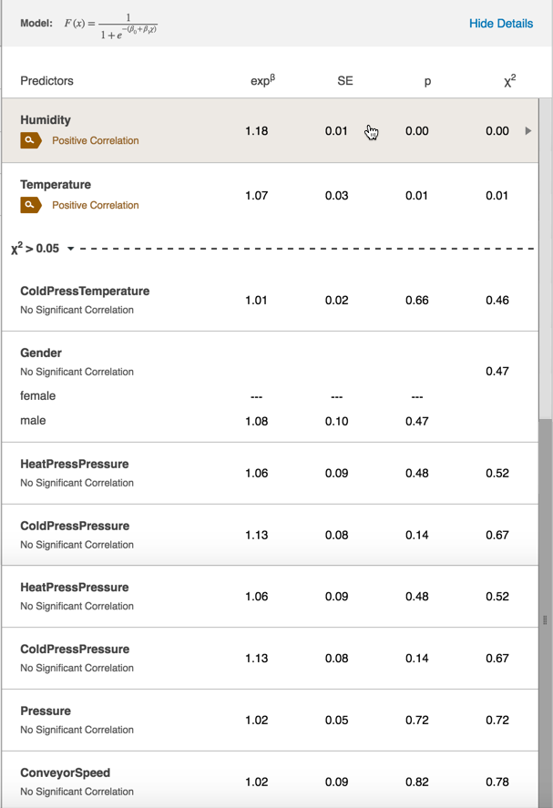
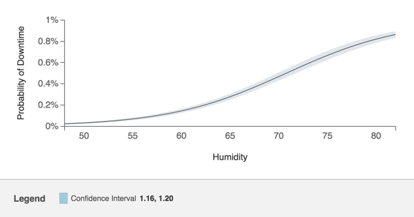
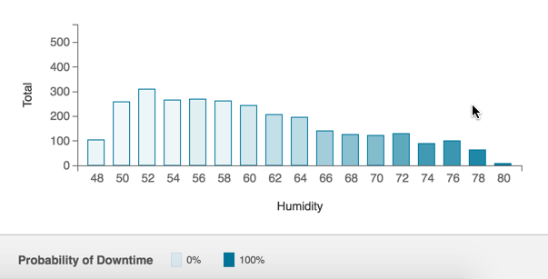

# Interpreting RCA Charts

 When you run the RCA in Sight Machine, it goes through all your data and does regression analysis to set up and select variables.
 
 For example, if you want to study availability on a machine, a first pass filter is applied to all the variables in the data set related to the machine. A lot of that data is highly correlated. Some variables may not vary within the data set. Sight Machine applies theory tools and techniques to filter this list of variables to display only those that are relevant. 
 
 
 
 Eight variables display in the Predictors table. On the Data Tab, 50 variables may display for the same machine. The RCA Predictors table displays data that is most likely to be a predictor of availability.

A regression analysis runs next. Regression analysis estimates the links among variables. In the table above, the dashed line separates variables that are likely to be significant KPI from those that are not. In the example above, the Humidity variable is a good predictor of availability.

On the right-hand side of the display, the top chart displays a gray line that is the "error envelop," or confidence interval. 

The lower chart takes the confidence interval from the top chart and displays as a histogram.

 

The data representation in the data set (humidity) includes shading that gives you more insight on the downtime event in this example. The lighter the color, the less likely the data points at that level of humidity created downtime. The darker shading indicates a higher likelihood that humidity created downtime.