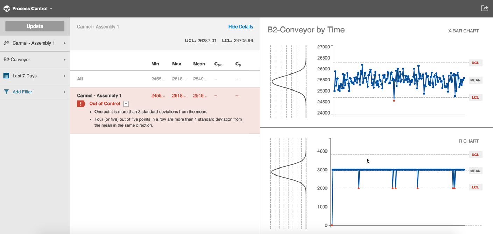
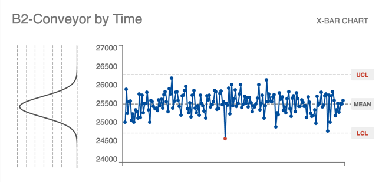
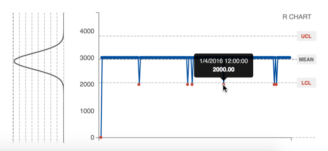

# Understanding SPC with Sight Machine

  
 
 The Statistical Process Control (SPC) chart separates special cause variance from common cause variance. In Sight Machine, you select a machine on which to run the Process Control algorithms, a variable to analyze, and other filters. 
 
 The results show a few things.
 

 
 On the left, the chart shows the machine name and the Out of Control items. "Out of Control" means the algorithm found some special cause variance (i.e. not normal variance). Special cause variance is determined by applying Nelson’s rules. Nelson's rules detect anomalies in the data.
  
  **Note:** A classic example of a Nelson's rule anomaly is a point more than three standard deviations from the mean.
 
 Other statistical algorithms compute and display the thresholds above the Out of Control section. The algorithms look for drifts or other unusual patterns in the data. For example, Cpk and Cp represent capability analysis. These metrics allow you to look at the probability that your process is going to make parts out of spec. If the Cpk and Cp values are blank, then there are no tolerances configured in your system. Sight Machine configured tolerances for your upon request.
 
  On the right, an X-Bar Chart takes a small slice of production data time and averages those points in time before plotting the averages. 
 

Each point is not a point of production data, but a point of production that happened (aggregated by one hour intervals).

The R Chart is under the X-Bar Chart and shows a range of points over that time. In the example below, within a time block 12 am to 1 am on January 4, 2016, the difference between the selected maximum/minimum data point was 2,000 degrees.

Upper control limit (UCL) and lower control limit (LCL) measure variance on three standard deviations from the mean. Any point outside those limits is a bad sign.

