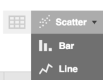
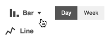

# Unique Analysis Tab Navigation

 The Analysis Tab includes more navigation options than the other Sight Machine tabs.
 
 1. The first option you can choose is the type of analysis or chart, from the Analysis Selector. Analysis Selection options include: Data Visualization, Key Performance Indicators, Process Control, and Root Cause Analysis.
 
 
 
  Depending on your Analysis Selector choice, different Filter Bar options display. The table below shows the Filter Bar options for each analysis type and the output type. All analysis types include the Add Filter option in the Filter Bar.
  
  | Analysis Selector        | Filter Bar Options       | Chart Type/Output        |
  | ------------------------ | ------------------------ | ------------------------ |
  | Data Visualization       | Cycle/Downtime/Parts, Asset Selector, Date Filter, Y Axis, X Axis, Comparison Selector | Bar, Line, or Scatter Charts |
  | Key Performance Indicators | Asset Selector, Date Filter, Y Axis, X Axis, Comparison Selector | Line Chart or Bar Chart |
  | Process Control| Asset Selector, Specific Measure, Date Filter | X-Bar Chart |
  | Root Cause Analysis| Asset Selector, Specific Measure, Date Filter | Predictors, Line Chart, Histogram |
  
  2. After you choose the Filter Bar options for the type of analysis you've selected, click Update to display the chart.
  3. The Data Visualization and Key Performance Indicators charts include additional view options in the upper right corner of the chart.
        * Data Visualization Chart Display icon: table, scatter chart, bar chart, or line graph
        
          
        * KPI Chart Display icon:  bar chart, line graph, day or week toggle
        
          

  4. xx
  5. xx
  
  