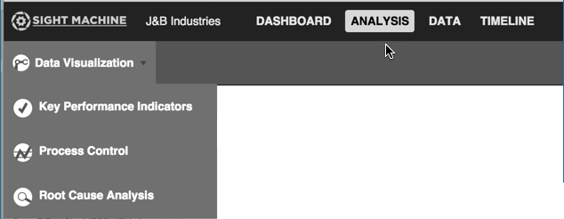
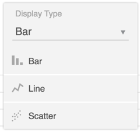
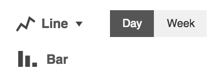
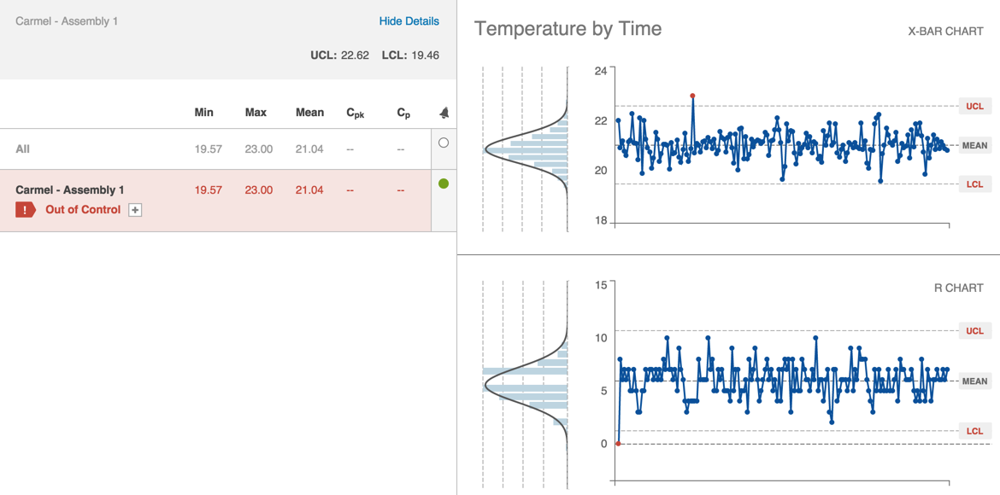
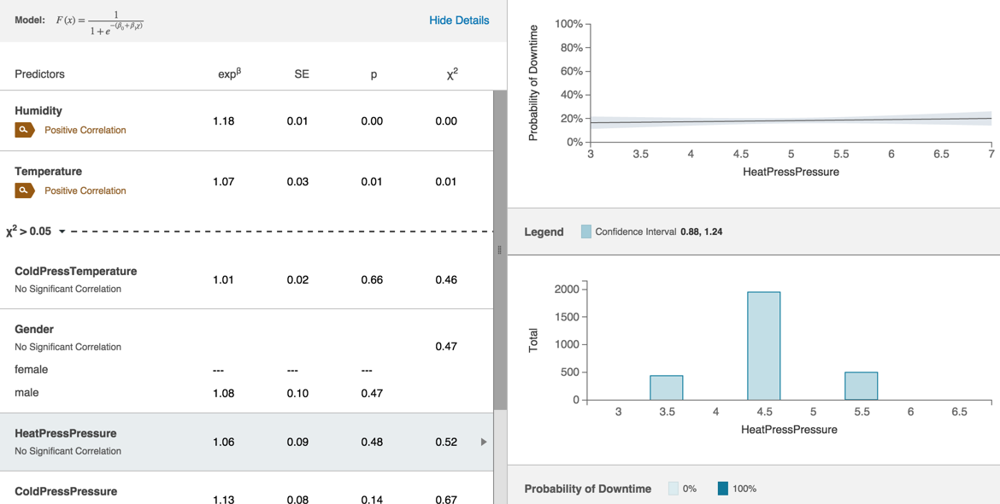

# Unique Analysis Tab Navigation

 The Analysis Tab includes more navigation options than the other Sight Machine tabs.
 
 1. The first option you can choose is the type of analysis or chart, from the Analysis Selector. Analysis Selection options include: Data Visualization, Key Performance Indicators, Process Control, and Root Cause Analysis.
 
   
 
  Depending on your Analysis Selector choice, different Filter Bar options display. The table below shows the Filter Bar options for each analysis type and the output type. All analysis types include the Add Filter option in the Filter Bar.
  
Analysis Selector | Filter Bar Options | Chart Type/Output
--- | --- | --- 
Data Visualization | Cycle/Downtime/Parts, Asset Selector, Date Filter, Y Axis, X Axis, Comparison Selector | Bar, Line, or Scatter Charts 
Key Performance Indicators | Asset Selector, Date Filter, Y Axis, X Axis, Comparison Selector | Line Chart or Bar Chart 
Process Control | Asset Selector, Specific Measure, Date Filter | X-Bar Chart 
Root Cause Analysis | Asset Selector, Specific Measure, Date Filter | Predictors, Line Chart, Histogram
  
 2. After you choose the Filter Bar options for the type of analysis you've selected, click Update to display the chart.
 3. The different charts include more navigation options.
  
       * Data Visualization Navigation (Display Type drop-down list): bar, line, scatter, or table
        
        
          
        * KPI Navigation (Chart Display icon): bar chart, line graph, or day/week toggle
        
          
          
          **Note:** You can also click the bar chart or line graph to display the Data Tab with the data details displayed in tabular form.
          
        * Process Control Navigation: click the value for the Minimum, Maximum, Mean, Process Capability Index (Cpk), or Process Capability (Cp) values to refresh the X-Bar Chart on the right:
          
        **Note:** Clicking the Alarm radio button for the row will set an alert.
        
        * Root Cause Analysis Navigation: click on any column value in the table on the left to refresh the line graph and bar chart on the right: expB, SE (Standard Error), p (probability), and X2.

           
           
           **Note:** Hover over any of the Predictors to see pop-up help explanations.

  
