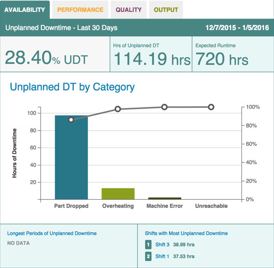
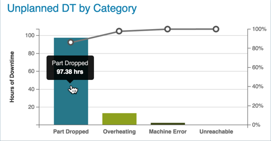

# Availability Chart

 Machine downtime appears as a Pareto chart on the Dashboard tab's Availability subtab. Use the following steps to refine and view downtime metrics from the Dashboard tab.
  
  **Note:** The Availability subtab may appear differently than in the image below. A unique name specific to your organization may display instead.
  
  
  
  1. On the Dashboard Tab, select an asset and date from the Filter Tab and click Update.
  2. Click the Availability subtab to display the Pareto chart. Unplanned downtime displays by category as a percentage of machine downtime.
   
   * Hover over the bar chart bars to see the number of hours of downtime for that category.

    

   * Hover over the points of the line graph to see the percentage of downtime for that category.
     
     
 
 