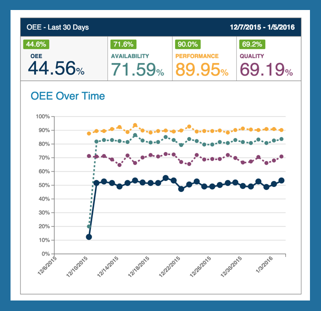

# OEE Chart

 The OEE Chart on the OEE Dashboard contains each of the four primary KPIs, and a chart of those KPIs over the selected date range.
 The value above the KPI represents the percent change in that KPI over the selected date range (indicated as green for positive change and red for negative).
 Clicking on any of the KPIs will navigate the 
 
 '