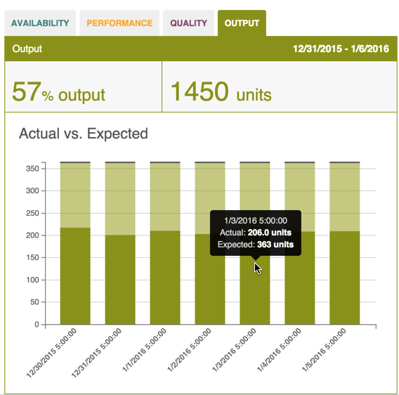

# Output Chart

 Actual output as a percentage of expected output appear as a bar chart on the Dashboard tab's Output subtab. Use the following steps to refine and view Output metrics from the Dashboard tab.
   
   **Note:** The Output subtab may appear differently than in the image below. A unique name specific to your organization may display instead.
   
   
   
   