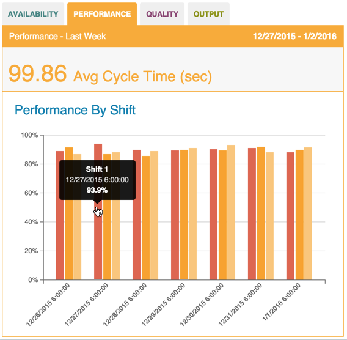

# Performance Chart

 Performance by shift appears as a bar chart on the Dashboard tab's Performance subtab. Use the following steps to refine and view performance metrics from the Dashboard tab.
  
  **Note:** The Performance subtab may appear differently than in the image below. A unique name specific to your organization may display instead. 
  
  
  
  1. On the Dashboard Tab, select an asset and date from the Filter Tab and click Update.
  2. Click the Performance subtab to display the Performance chart. Performance by shift displays by date as a percentage of shift time.
   
   * Hover over the bar chart bars to see the shift, date, cycle time, and performance percentage.