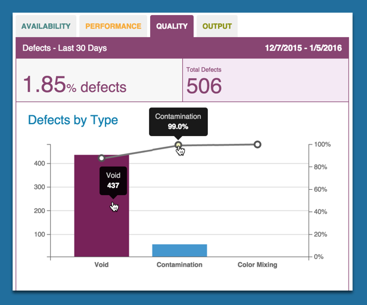

# Quality Chart

  Defects by type appear as a bar chart on the Dashboard tab's Quality subtab. Use the following steps to refine and view performance metrics from the Dashboard tab.
   **Note:** The Quality subtab may appear differently than in the image below. A unique name specific to your organization may display instead.
  
  
  
  1. On the Dashboard Tab, select an asset and date from the Filter Tab and click Update.
  2. Click the Quality subtab to display the Quality (Pareto) chart. Defects by type display as a percentage of cycle time.
   * Hover over the bar chart bars to see the total number of defects by defect type for the cycle.
   * Hover over the line graph points to see the percentage of defects for that type for the cycle.
   * Clicking the bar chart or line graph displays the Data Tab. On the Data Tab, a table view of the defects by type displays in more detail.