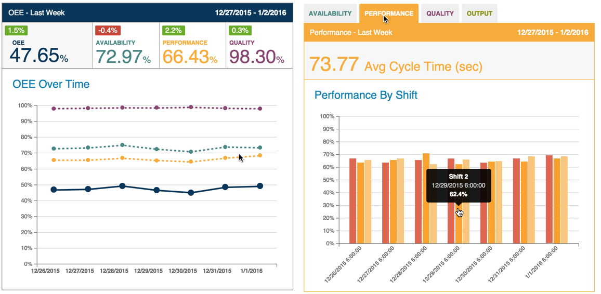
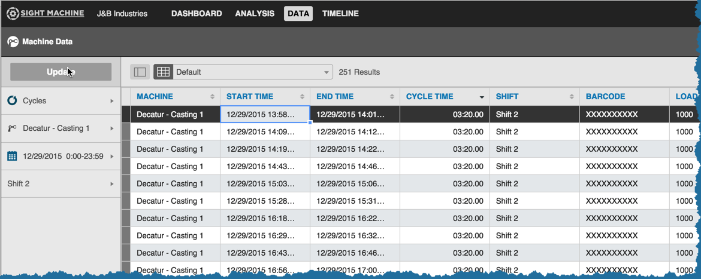

# Using the Dashboard Tab
 On the Dashboard Tab, a typical workflow for a manager follows these steps:
 
 1. Use the Filter Bar to select an asset and date range and click Update to refresh the view.
 2. Review the data presented for any areas of concern.
 3. Drill down into the data for any areas identified as concerns.

 For example, in the image below, Performance may appear to be less than optimal.

 The manager then clicks on the Performance subtab to view Performance By Shift. By hovering over the bar graphs, they identify a lower-than average cycle time. 
 
 The  manager clicks the bar graph and the Data Tab displays. They click the Update button, and detailed machine data for the shift displays.
 
 
 
 The Cycle Time sort icon already displays the longest cycle times first. The manager reviews this data and its associated factors in the table (items such as load, pour, dwell, etc. pre-configured to your specific manufacturing process). The manager determines that oil temperature beyond a certain range increased this machine's cycle time. Adjustments to control oil temperature are made, and performance improves.