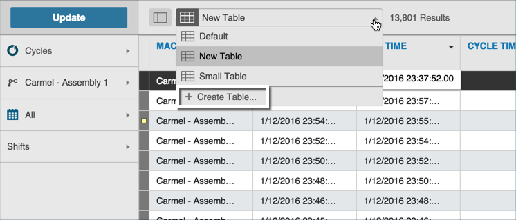

# Creating Custom Tables

There are two data types that allow table customization: Cycles and Downtime. The downtime data table displays allows you to reorder and remove columns. See [Unique Data Tab Navigation](../dataTab/uniqueDataTabNav.md) for more information on the downtime table customization.

The cycles data allows for more custom table modifications. Use the following steps to create a custom table for cycle data.

 1. On the Data Tab, select Cycles from the Data Type selector, select all other Filter Bar options (i.e. Asset Picker, etc.) and click Update. Tabular data displays by cycle.
 2. Select Create Table from the New Table drop-down list.
 
 
 
   The Create Table screen displays with all the options to customize your table.
   
 
   1. Enter a name for your custom table, a description, and, if desired, the number of columns to freeze.
   2. In the Columns Selected pane, click and drag column names to order them. Click an X icon to remove a column name from your custom table. The removed column moves to display in the Available Columns pane to the left of the Columns Selected pane. 
   3. Click the Save Table button to save your custom table. Focus returns to the Data tab with  the newly-created table displayed.