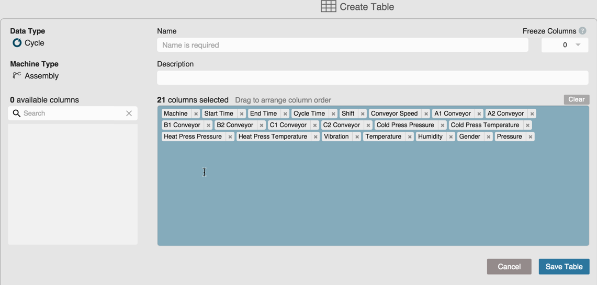

# Creating Custom Tables

You can create custom tables for Cycles data. Use the following steps to create a custom table for cycle data.

 1. On the Data Tab, select Cycles from the Filter Bar. Select all other Filter Bar options (i.e. Asset Picker, etc.). Tabular data displays by cycle.
 2. Click the Table icon to open the Accumulator.
 
 
 
   The Create Table screen displays with all the options to customize your table.
   
 
   1. Enter a name for your custom table, a description, and, if desired, the number of columns to freeze.
   2. In the Columns Selected pane, click and drag column names to order them. Click an X icon to remove a column name from your custom table. The removed column moves to display in the Available Columns pane to the left of the Columns Selected pane. 
   3. Click the Save Table button to save your custom table. Focus returns to the Data tab with  the newly-created table displayed.