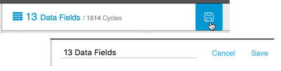
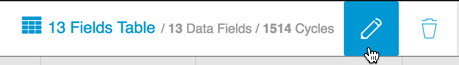

# Creating Custom Tables

You can create custom tables for Cycles data. Use the following steps to create a custom table for cycle data.

 1. On the Data Tab, select Cycles from the Filter Bar. Select all other Filter Bar options (i.e. Asset Picker, etc.). 
    * Tabular data displays by cycle.
    * The total number of Data Fields and Cycles displays next to the Table icon.
    
 2. Click the Table icon to open the Accumulator.
 
 
 
   3. In the Accumulator select or deselect the radio buttons for the data items you want in your custom table.
   1. Click Apply to apply your changes and display the selected data in a table. 
   3. Click the Save Table icon to display an editable version of the default table name. Edit the table name to the name you want, and click Save.

  
  
  **Note:** After you've saved your custom table name, you can edit it by clicking the Edit icon. The Delete icon (to the right of the Edit icon) will delete that custom table. 
  
  