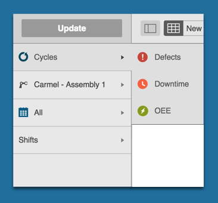
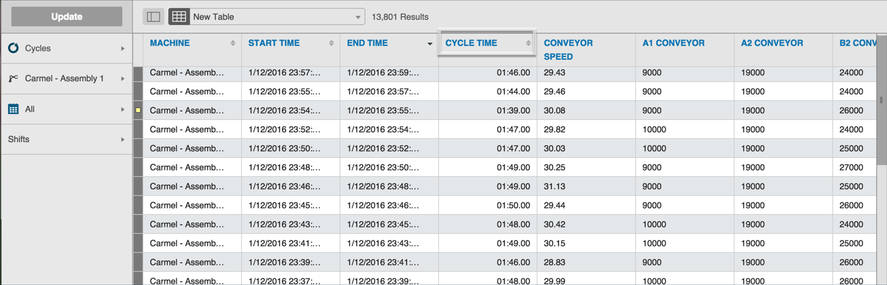

# Filtering Data Tables

   You can filter the data tables to display Cycles, Defects, Downtime, or OEE by selecting one of those options from the Data Type selector in the Filter Bar.
   
   
   
   When you click Update, the data table displays data based on your selection. 
   
   