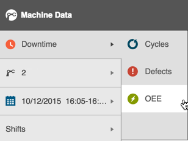
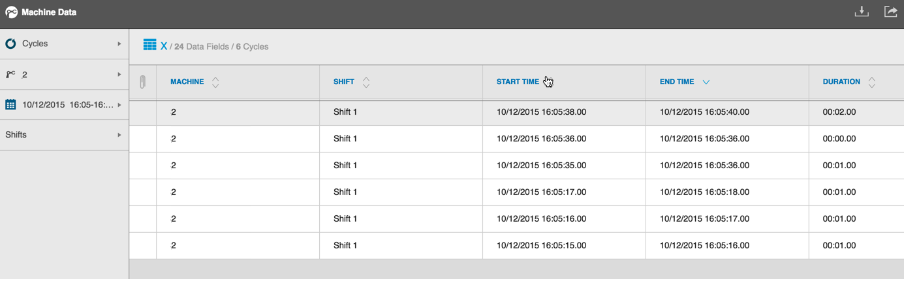

# Filtering Data Tables

 Select Cycles, Defects, Downtime, or OEE from the Data Type selector in the Filter Bar to display data.
   
   
   
   The data table automatically displays data based on your selection. 
   
   
   
   Filter your data further by selecting a different machine, date and time, and Shift from the Filter bar.
   
   Sort table data in ascending or descending order by selecting a column with an up/down arrow icon and clicking it. For example, click the up arrow in the Start Time column header to display all rows sorted by earliest start time to latest.