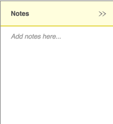
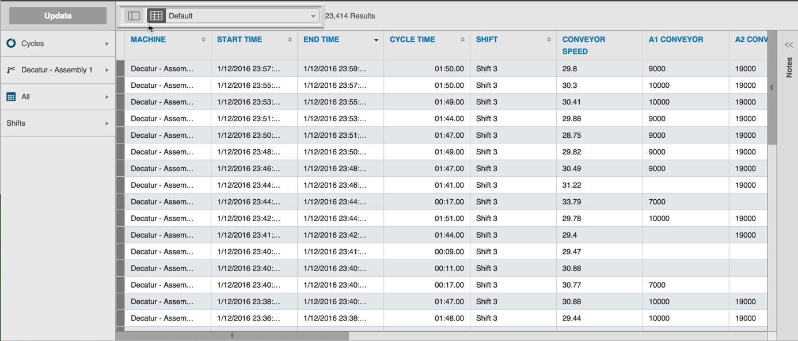
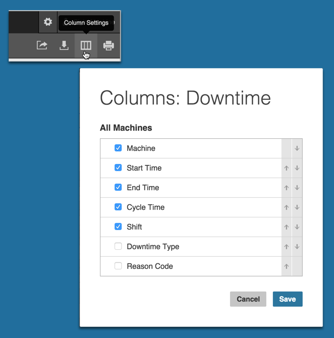

# Unique Data Tab Navigation

On the Data tab, Filter Bar options differ based on the data type selected: 

  * Cycles
  * Defects
  * Downtime
  * OEE

 **Note:** See [Other filters](../Documentation/master/otherfilters.md) for Filter Bar options.

General Data Tab navigation allows you to:

 * Sort the displayed data in ascending or descending order by selecting the up/down arrow icons next to the column labels
 * Add notes when you click the Notes expand icon (on the far right of the screen) 

  

The Cycles and Downtime data options include some unique navigation items.

**Cycles Data**

When you choose Cycles from the Data Type selector, and click Update, the data displays in tabular form by default. However, you can click the Image View icon to toggle from Table View to Image View. 

**Downtime Data**

An additional Column Settings icon appears when you choose Downtime from the Data Type selector.

In the Columns: Downtime dialog box:
  1. Click the up/down arrow icons to sort where columns display (form left to right) in the table. 
  2. Select or clear the check boxes to configure which columns do/don't display.
  3. Click Save to save your settings and return to the Data Tab with your selections applied.

