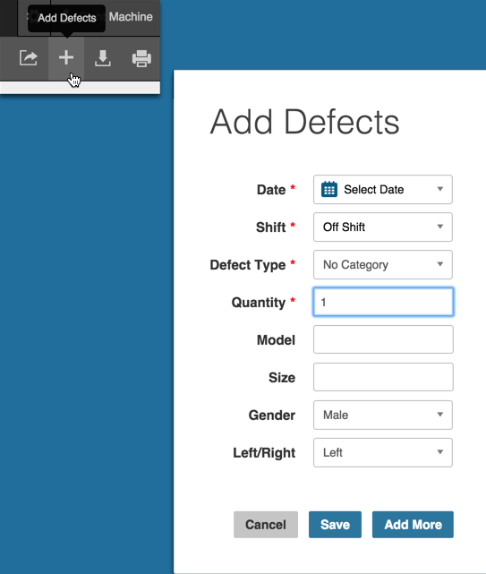

# Unique Data Tab Navigation

On the Data tab, Filter Bar options differ based on the data type selected: 

  * Cycles
  * Defects
  * Downtime
  * OEE

 **Note:** See [Other filters](../generalNavigation/OtherFilters.md) for Filter Bar options.

General Data Tab navigation allows you to:

 * Sort the displayed data in ascending or descending order by selecting the up/down arrow icons next to the column labels
 * Click and drag to adjust column width
 * Hover, click, and drag to re-position columns
 

**Cycles Data Navigation**

When you choose Cycles from the Data Type selector the data displays in tabular form by default. Any row that has an Image icon allows you to click, view, and download that image. 

See [Filtering Data Tables](../dataTab/filterhingDataTables.md) for other filter options.

**Defects Data Navigation**

An Add Defects icon appears in the upper right of the screen when you choose Defects from the Data Type selector. You can use the Add Defects icon/dialog box to add a new defect.

In the Add Defects dialog box:

 1. Select the values from the Date/Shift/Defect Type drop-down lists.
 2. Enter values in the free-form text fields. Field names may be unique to your company/product. 
 3. Click Save to save the defect or click Add More to add more defect types.
 4. Once you save your values, the Add Defects dialog box closes and focus returns to the Data Tab.

