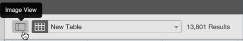
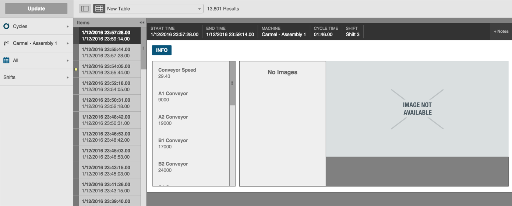
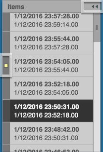
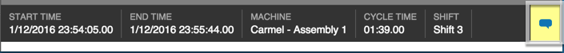

# Using the Image View

 When you choose Cycles for your Data Type, you can switch from table view to image view to see an image of the machine or part. 
 
  * The table view is the default view. 
  * Clicking the Image View icon switches the display to image view.
 
 
 
 The image view includes three separate panes to the right of the Filter Bar.
 
  * An Items pane that has options broken down by time increments
  * An Info pane that displays the asset's machine aspects for that time range and part
  * An Image pane that shows the camera image of the part (if available)
 
 
 **To use the image pane:**
 
 1. Click a time range in the Items pane to select it. Note that the header bar value above the Info and Image panes changes to show the details for that time range.
 2. Scroll from top to bottom in the Info pane to see all the asset's machine parts for that time frame.
 3. If available, view the camera image for that cycle.

  **Items Pane Details**

   * Click the Hide/Expand double-arrow icon to hide or Expand the Items pane.

    
  
    * Any cycle item that has notes associated with it displays a yellow square to the left of the item. When you click the yellow square, the Notes icon in the upper right corner of the screen appears yellow. Clicking the Notes icon displays any notes.
  
      
  
  

 
 
 
 
 