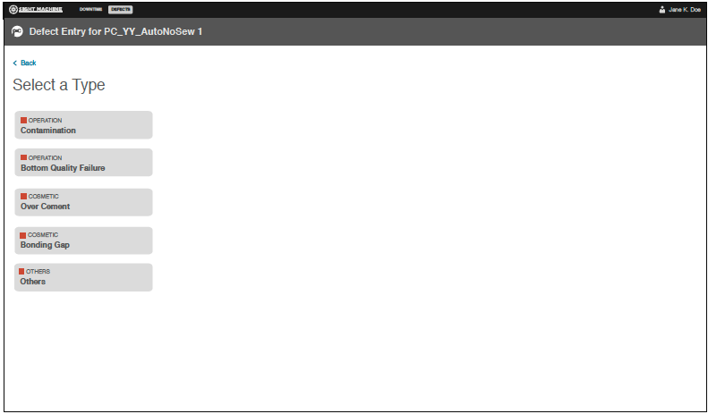

# Line Operator Defect Entry

A line operator can use a tablet to enter a defects at the machine or line at the time in which they are detected. This real-time defect entry does not require a working Internet connection. If the Internet connection goes down, the line operator will still be able to add a defect, and the added defects will be synchronized to the cloud pending Internet availability.

Consider the example of a line operator responsible for catching discolored shoe parts. That line operator would follow these instructions to record a defective item.

**Note:** The images below are only examples and your tablet display will appear differently, with defect types unique to the machine type of interest. These defect types are configurable from the Settings view.

1.  Select a machine from the Machine drop-down list and then tap the Add Defect button.

    

    This displays the Defect Entry screen.

    

2.  Select a defect type and then tap the Back link at the top left to return to the Add Defect screen.

    

**Parent topic:**[Quick Start: Defect Entry](enterDefectsIntro.md)

