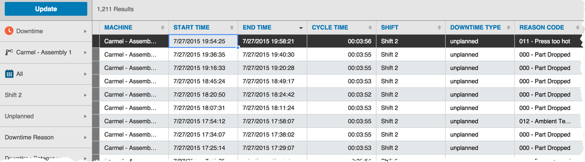

# Batch Downtime Entry

A manager or a QA lab technician might record multiple downtimes or need to edit downtime types and reasons for downtimes entered by either line operators or auto-detection.

The instructions below are steps for viewing reported downtime in Sight Machine.

1.  On the Data tab, select Downtime from the Update Menu to toggle the Update Menu options to downtime-specific choices.

    

2.  Click to select details from the Update Menu and click Update. Machine downtime data displays according to your criteria.

    

