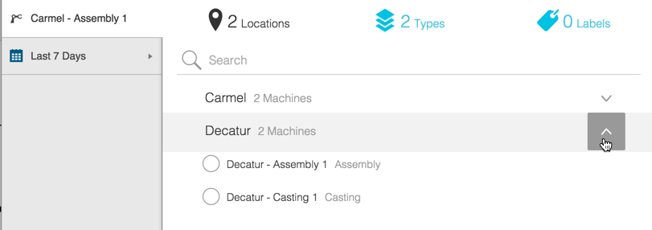
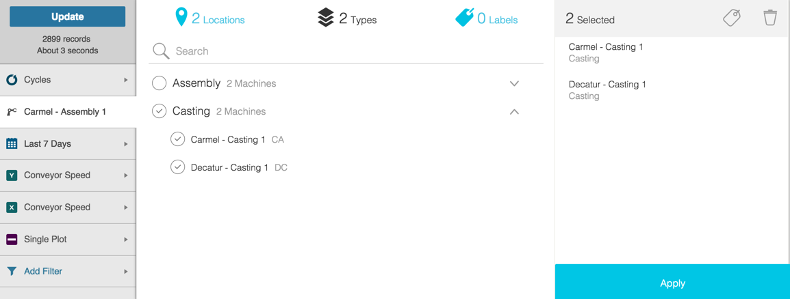
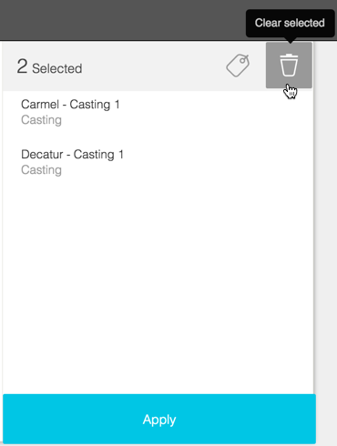

# Using the Asset Picker
 The Asset Picker is the left-hand menu option that lets you select an asset, or machine, for which you want to view data. The example below is an image of the Asset Picker as it appears on the Dashboard tab.

* You can choose how you select your asset by clicking one of the Asset Picker views: Locations, Types, or Labels. 
* Clicking the expand or contract arrows displays all the options within that view.
* Selecting an asset radio button causes the Asset Picker to close, and displays the tab data for the selected machine.

The Asset Picker appears the same for the Dashboard, Data, and Timeline tabs. It displays more options on the Analysis tab.

* You can click the top-most radio button to select all options for either the Location or Type.
* In the right-hand side Asset Picker you can:
   * Click Apply to close the Asset Picker and view data for selected asset(s).
   * Click the New Label icon to create a new custom label (see image below).
   * Remove a previously-created custom label.
   * Click the Garbage icon to deselect your previous asset selections.

    

Once you've entered a custom label, click the Check Mark icon to save it, or click the X icon to delete it.

