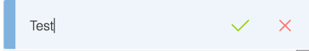

# Using the Assets Picker

The Asset Picker is the left-hand menu option that lets you select an asset \(machine, line, or facility\) for which you want to view data. The example below is an image of the Asset Picker as it appears on the Dashboard tab.

* Choose your asset by clicking one of the Asset Picker views: Locations, Types, or Labels. 
* Click the expand or contract arrows to display\/hide all the options within that view.
* Select an asset radio button. The Asset Picker auto-closes and displays the data for the selected machine.

The Asset Picker appears the same for the Dashboard, Data, and Timeline tabs.

On the Analysis tab, the Asset Picker displays an additional Machines Selected panel that lets you apply a custom label to save your asset selections.

On the Analysis tab:

1. Click the top-most radio button to select all options for either the Location or Type. The selected assets appear in the right-most Machines Selected pane.
2. In the right-side pane in the Asset Picker you can:

   * Click Apply to close the Asset Picker and view data for selected asset\(s\).
   * Click the New Label icon to create a new custom label \(see image below\).
   * Remove a previously-created custom label.
   * Click the Garbage icon to deselect your previous asset selections.

     
   3. Once you've entered a custom label, click the Check Mark icon to save it, or click the X icon to delete it.

   

