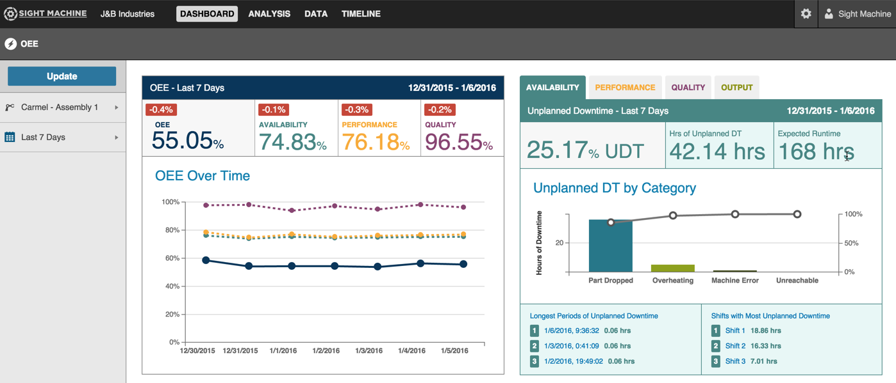

# General Navigation
 When you first log in to Sight Machine, the Dashboard Tab home page always displays.
 
 
 
 The Dashboard Tab's button appears selected as a light-gray button with dark-gray Dashboard text. The Sight Machine application divided into four sections:
 * Tabs
 * Filter Bar
 * Data Display
 * Application Functions

Tabs display across the top of the screen and include: the Dashboard Tab, Analysis Tab, Data Tab, and Timeline Tab.

The Filter Bar displays at the far left and includes selectable options by which to filter your data.
 
The data display area is the middle of the screen. The information is usually graphical (charts) or tables (rows and columns) by tab. 
 
Application functions display in the top right of your screen. On the Dashboard Tab the Settings icon (gear) and Sight Machine button display. 
  
  * Clicking the Settings icon displays the Settings screen. This is where you configure user settings, permissions, and machine settings.
  * Clicking the Sight Machine icon displays the Log Out button.

 More application functions appear on the other Tabs. Functions may include: Share, Export Data, and Print functions.
 