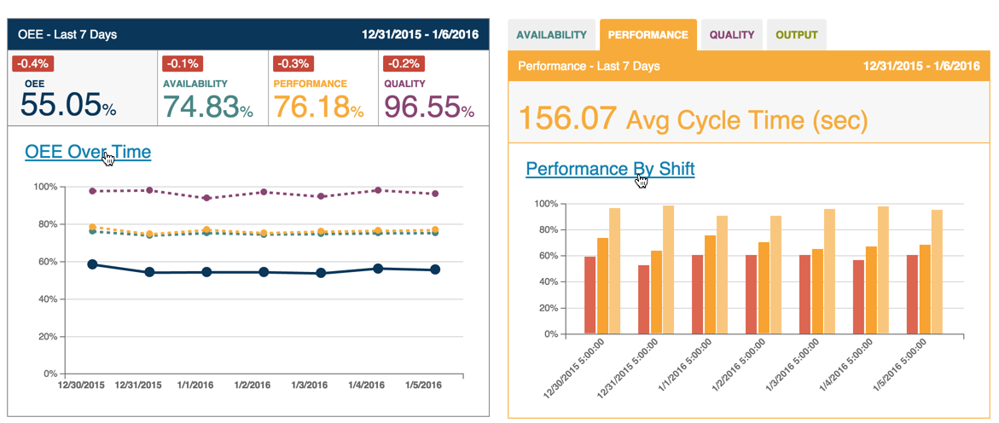
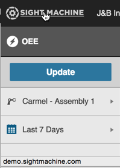

# Hovering Over Items

When you hover over text and\/or graphical elements there are three different kinds of responses:

* Hovering over tabs or buttons makes them appear lighter or darker, indicating you are about to select it
* Hovering over graphical elements, such as charts, displays pop-up details or help text
* Hovering over some text makes it display as underlined, indicating an active link

  Here is an example of hovering over a tab. 

  

 The current tab in focus appears as white button with dark lettering. The other tabs display with white lettering on a dark gray background. Hovering over one of these tabs causes the tab background to display with a light gray background.

Most graphical elements display detailed data or pop-up help text. For example, in the bar chart below, hovering over the bar shows the specific count for that conveyor speed.

On the Dashboard Tab, hovering over the OEE Over Time or sub-tab titles displays an underlined active link. 

When you click the linked text, focus will go to the detailed display for the linked topic.

** Note:** Clicking either of the two links in the above examples takes you to the Analysis tab.

Also, when you hover over the Sight Machine logo in the top left corner, the URL for the home page displays in the lower left.

**Note:** Clicking the Sight Machine logo from any tab will return focus the Dashboard Tab.

