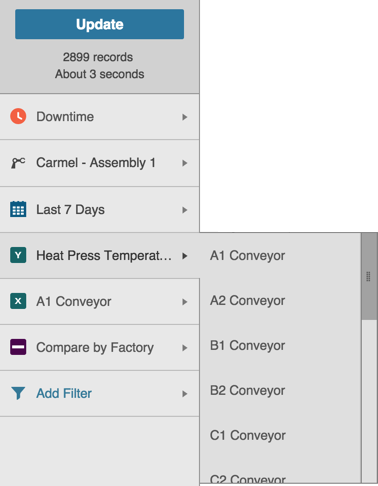
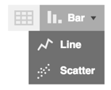
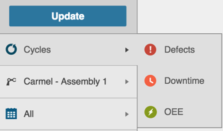
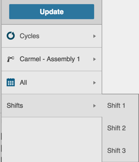
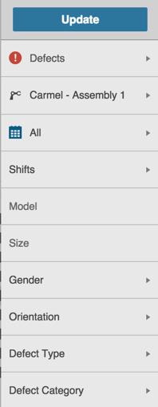
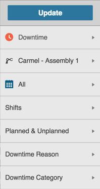
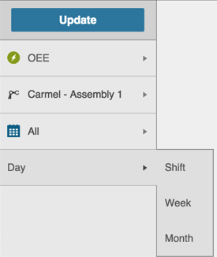

# Other Filters
 
 Other filter types in Sight Machine include:
 
 * Cycles
 * Machine specifics (i.e. speed, machine type)
 * Chart types
 * Shifts
 
 1. In each type of filter, click the Expand icon to display your options.
 2. Click to select your filter option. The Expanded options retract and the Filter Bar displays your selected filter. After you make your selection, extra, related options may display lower down in the Filter Bar.
 3. Click to select any related option in the Filter Bar.
 4. Click Update to apply all your filters.
 
    **Note:** The Asset Picker and the Date Picker always display in the Filter Bar. The extra, conditional filters that display based on the Cycle, Defect, Downtime, etc. are configurable. 
 
**Cycles, Defects, Downtime, OEE, Parts**
 The Analysis and Data Tabs both include a Cycle Filter and Downtime Filter option. 
 
 On the Analysis Tab, data displays by cycle, downtime, or parts when you select one of the corresponding filters:
 
 * Cycle Filter
 * Downtime Filter
 * Parts Filter  
 
 
 
 
 The Analysis Tab also includes Machine Specific Filters. In the image above, the Heat Press Temperature and A1 Conveyor filters include extra options.
 
 The Analysis Tab has a Chart Filter that displays in the top right of the data screen. Click to select a table view, bar chart, line chart, or scatter chart of your data. 
 
 
 
 
 On the Data Tab, the Filter Bar displays extra filter options based on the Cycle selected:
 
 
  
 
  * When you select the Cycle Filter, the Shift Filter displays in the Filter Bar.
 
   
   
   
  * When you select the Defect Filter, a list of your unique Defect Filter options display in the Filter Bar.

    
  
    
  * When you select the Downtime Filter, a list of your unique Downtime Filter options display in the Filter Bar.
  
    
  
    
  * When you select the OEE Filter, a Day Filter displays in the Filter Bar.
  
    
  