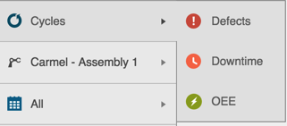
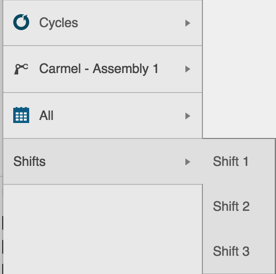
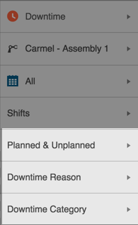
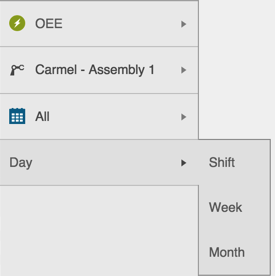

# Other Filters

Other filter types in Sight Machine include:

* Cycles
* Machine specifics \(i.e. speed, machine type\)
* Chart types
* Shifts

* In each type of filter, click the Expand icon to display your options.

* Click to select your filter option. The Expanded options retract and the Filter Bar displays your selected filter. After you make your selection, extra, related options may display lower down in the Filter Bar.
* Click to select any related option in the Filter Bar. The data results refresh to reflect the new date.

  **Note:** The Asset Picker and the Date Picker always display in the Filter Bar. The extra, conditional filters that display based on the Cycle, Defect, Downtime, etc. are configurable.

**Cycles, Defects, Downtime, OEE, Parts**
The Data Tab Asset Picker includes Cycles, Defects, Downtime, and OEE options. Selecting any one of these options causes additional, related Asset Picker options to display or hide.

For example, selecting the Downtime filter on the Data Tab causes the Planned & Unplanned, Downtime Reason, and Downtime Category Filter options to display.

* 

The Analysis Tab includes Machine-Specific Filters. In the image above, the Heat Press Temperature and A1 Conveyor filters include extra options.

The Analysis Tab includes a Chart Filter that displays in the top right of the data screen. Click to select a table view, bar chart, line chart, or scatter chart of your data.

On the Data Tab, the Filter Bar displays extra filter options based on the Cycle selected:

* When you select the Cycle Filter, the Shifts Filter displays in the Filter Bar.

  

* When you select the Defect Filter, a list of your unique Defect Filter options display in the Filter Bar.

  

* When you select the Downtime Filter, a list of your unique Downtime Filter options display in the Filter Bar.

  

* When you select the OEE Filter, a Day Filter displays in the Filter Bar.

  

