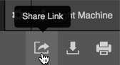
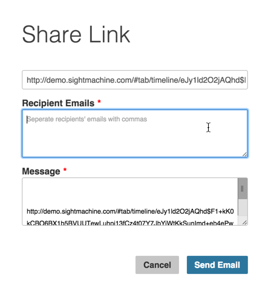

# Using the Share Link
 The Share Link button displays on the Analysis, Data, and Timeline Tabs in the upper right corner of the screen. The Share Link button allows you to send someone a link to the data.
 
 1. On either the Analysis Tab, Data Tab, or Timeline Tab: Click the Share Link button to display a Share Link dialog box. 

  

 2. Follow the instructions to either: 
    
    * Copy the link to your email application:
     
      1. Click Command + C to copy the link.
      2. Navigate to your email application of choice and click Command + V in the email body to paste it.
     3. Click the Done button in the Share Link dialog box to close it.
     
       
     
    * Send an email with the link from the Share Link dialog box:
     
       1. Click the Send Link in an Email to display the Recipient Emails and Message fields.
       2. Enter email recipients and any message text. Note that the URL is auto-pasted into the Message field.  
       3. Click Send Email to send the link to your email recipients.
       4. Click OK in the Email Confirmation dialog box to close it.
       
       
  
     
     
     
     
 