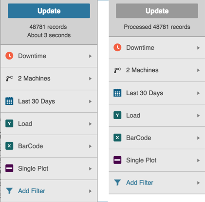

# Using the Update Button
 The Update button applies all selected filters and displays the data results or view.
 
 1. On any Tab, click and select filters on the Filter Bar.
 2. Click the Filter Bar's Update button. Data in chart or table form displays with your filters applied.

