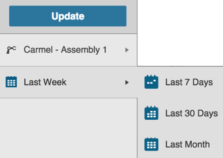
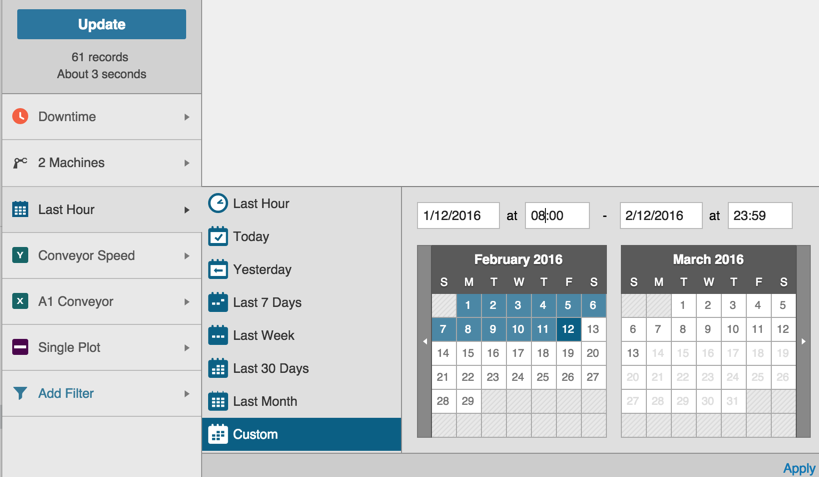
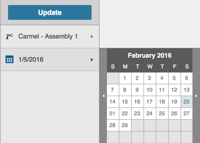

# Using the Date Filter
 
 The Date Filter allows you to filter results by date and is in the Filter Bar for all tabs. Date Filter options display when you click the Expand icon. Date Picker options display differently for each tab.
 
 
 **Date Filter on the Dashboard Tab**
 

1. Click the Date Picker Expand icon to display date options.
2. Click to select one of the date options. The Date Picker options retract and the selected Date Option text displays in the Filter Bar.
3. Click Update to apply the date filter.

**Date Filter on the Analysis and Data Tabs**

 
 On the Analysis and Data Tabs the Date Picker includes a Custom date option.
 
 1. Click the Date Picker Expand icon to display date options.
 2. Click one of the options to select it. The Date Picker options retract and the selected Date Option text displays in the Filter Bar.
 3. Click Update to apply the date filter.
  
  **Note:** To choose the Custom option:
  
   1. Scroll to the beginning month by clicking the Calendar's Arrow icon. 
   2. Click the day that you want in the month.
   3. Repeat steps 1 and 2 for the ending Month. The selected dates appear in the Date fields above the Calendars. 
   2. Enter times in the corresponding Time fields above the Calendars. 
   3. Click the Apply button. The Date Picker options retract and the selected date range displays in the Filter Bar.
   4. Click Update to apply the date filter.

**Date Filter on the Timeline Tab**

1. Click the Date Picker Expand icon to display the Calendar.
2. Scroll to the month you want by clicking the Calendar's Arrow icon.
3. Click the day for that month that you want. The Date Picker options retract and the selected date displays in the Filter Bar.
3. Click Update to apply the date filter.
 