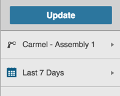
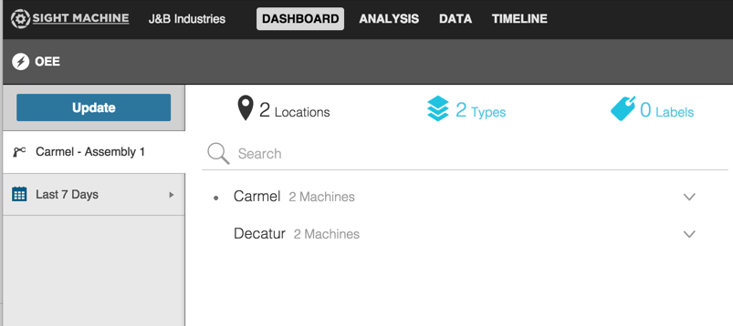
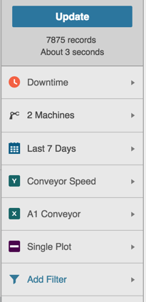
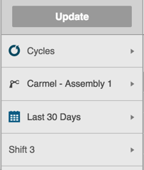
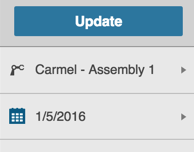

# Using the Filter Bar
 
 The Filter Bar is the left-most panel on all the tabs in Sight Machine. The Update button appears at the top of the Filter Bar. All filter options, specific to each tab, display below the Update button.
 

Clicking any of the filter options displays an expanded menu with detailed options.

To apply a filter on any of the tabs using the Filter Bar:
 1. Click an option in the Filter Bar to display the expanded menu.
 2. Select an option from the expanded menu, providing parameters as allowed. Once you make a selection/enter a value, the expanded menu retracts. 
 3. Click Update to apply the filter and automatically display results on the tab based on the selected filters.
 
 
 **Analysis Tab Filter**
 
 

**Data Tab Filter**

 

**Timeline Tab Filter**

 
