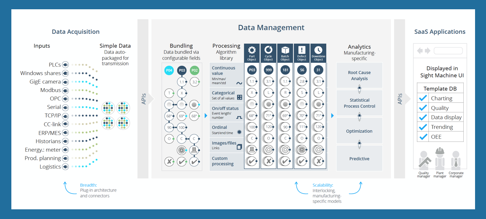

# OEE Calculations with Sight Machine

 The platform is a unique architecture for transforming manufacturing data and providing semantic context.
 
 Overall Equipment Effectivness (OEE) calculations are measured by creating objects based on cycles and downtime and then calculating:
 
 * availability
 * output
 * performance
 * quality (includes data from entered defects

