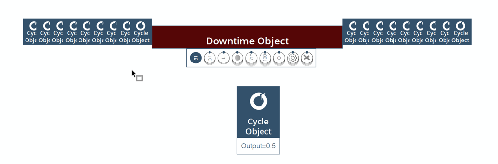

# Calculating Output
 Each cycle has an ‘output’ field, in which we store the total output for that cycle.
This can be a static cycle_multiplier value (e.g. 0.5 for machines that make one shoe at a
time), or it can be recipe-dependent and read from the data.

**Note:** Output for Nike machines is in ‘Pairs of Shoes’, whenever possible.