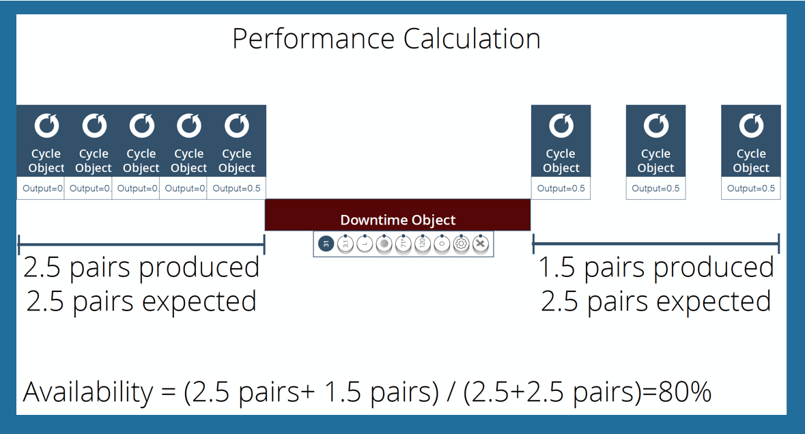

# Calculating Performance
 Performance is Actual Output divided by Expected Output.
 
 
 
  * Expected output can be static-defined based on ideal cycle time, or a variable based on a recipe
  * Periods of downtime do not contribute to either the numerator or denominator for performance calculations
  * Part-based output is used for machines that can create several cycles per part