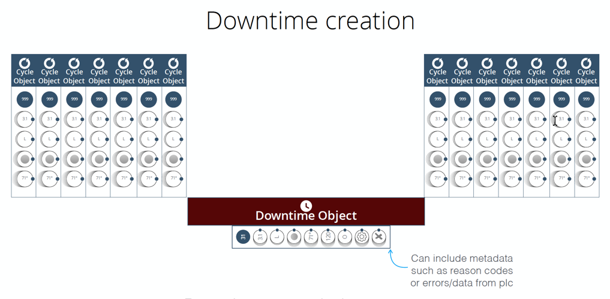

# Creating Downtime Objects
 Downtime objects are machine downtime that are transformed into discrete units that are displayed in Sight Machine.
 
  Downtime is created when:
    * there is an absence of a new cycle for longer than the configured Max_Cycle_Time
    * an explicit signal from the data indicates downtime

  Downtime ends when a new cycle begins.
