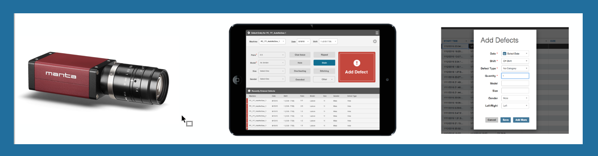

# Entering Defects
 There are three ways to enter defects in Sight Machine:
 
  1. Automated defect creation from 100% in-line quality systems (e.g. camera check)
  2. Manual defect entry via touchpad
  3. Batch or single-item entry via the Data Tab

