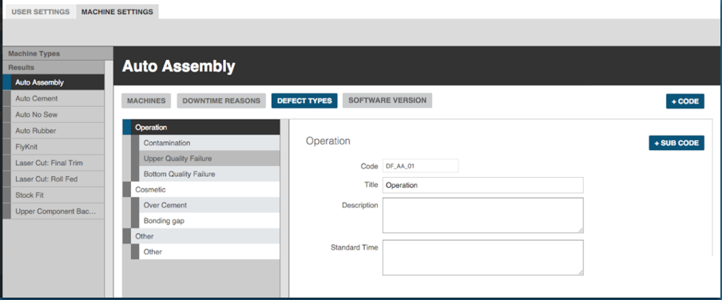
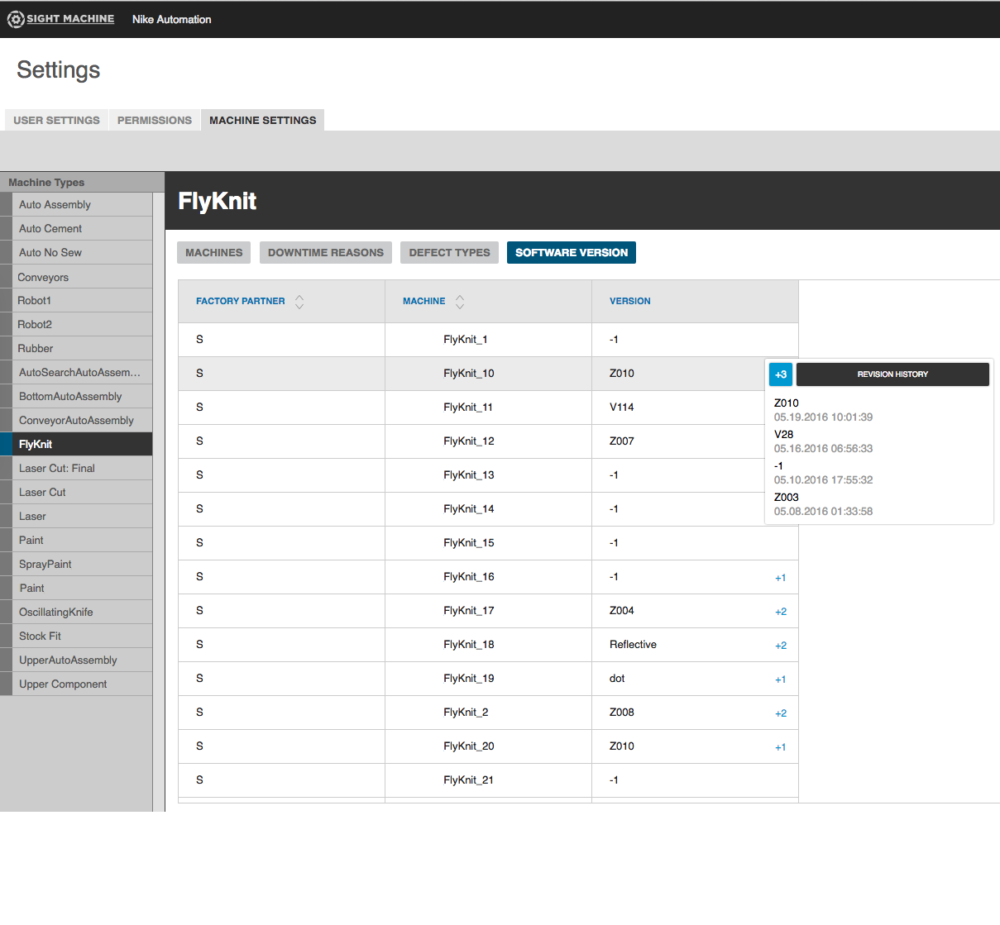

# Machine Settings Tab

The Machine Settings tab is where a manager configures the machines and defects and downtime codes that appear throughout Sight Machine. Only managers can configure machines to ensure Sight Machine provides consistent and clear data.

A manager designated to enter machines, defect types, and downtime reasons can enter as many as needed.

1. Click the Gear icon in the Toolbar to display the Settings view.
2. Click on the Machine Settings tab.

 

 To add a machine to Sight Machine:  
   
  1. Click the Machines button. 
  2. Click the Code button to display the Add Machine dialog box.
  3. Enter appropriate values in the fields and click Save. The machine you just added displays in the list of machines and throughout Sight Machine's tabs. 

 To add a new downtime reason to Sight Machine:
  
 1. Click the Downtime Reasons button.
 2. Click the Code or Sub Code button to display the Add Downtime Reason dialog box.
    **Note:** If you are entering a downtime sub code, be sure to select a current code in the list of downtime reasons first. This indicates to which code the sub code will be subordinate.
 3. Enter appropriate values in the fields and click Save. The downtime reason you just added displays in the list of downtime reasons and throughout Sight Machine's tabs.

 To add a new Defect Type to Sight Machine:
 
  1. Click the Defect Types button.
  2. Click the Code or Sub Code button to display the Add Defect Type dialog box.
    **Note:** If you are entering a defect type sub code, be sure to select a current code in the list of defect types first. This indicates to which code the sub code will be subordinate.
  3. Enter appropriate values in the fields and click Save. The defect type you just added displays in the list of defect types and throughout Sight Machine's tabs.

To check the Software Version for a machine:

1. Click the Software Version button.
2. Click a machine in the left-side Machine Types list to select it.
3. In the Version column, click any +N link to display pop-up machine version information.

  