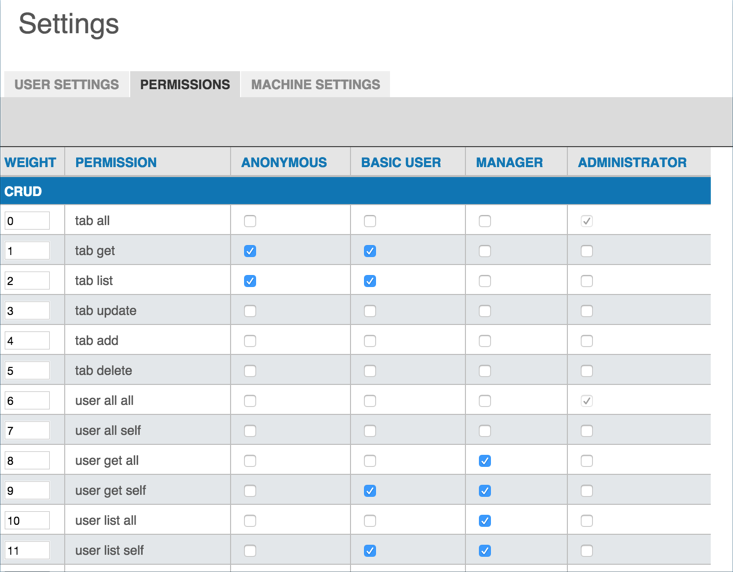
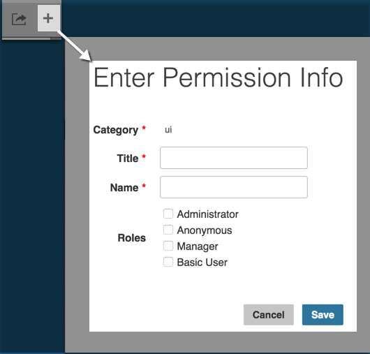

# Permissions Tab

The Permissions tab is where you configure Sight Machine application permissions by user role. The configuration takes the form of check boxes setting classic CRUD (create, read, update, delete) functionality by tab. Users with Administrator roles can update the Permissions tab.

 To allow a particular role access to a particular tab or feature:

 1. Click to select the check box on the row for that tab/feature permission for the user role column. Roles include: Anonymous, Basic User, Manager, and Administrator.
 2. The permission saves automatically.

To add a new permission:

1. Click the + icon in the upper right corner to open the Enter Permission Info dialog box.

3. Enter values in the required fields.
4. Select the check box(es) for the role(s) you want the permission to apply to automatically. 
5. Click Save to close the Enter Permission Info dialog box. A new row appears in the Permissions table for the permission you created. Any roles you selected are selected for the permission.