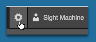
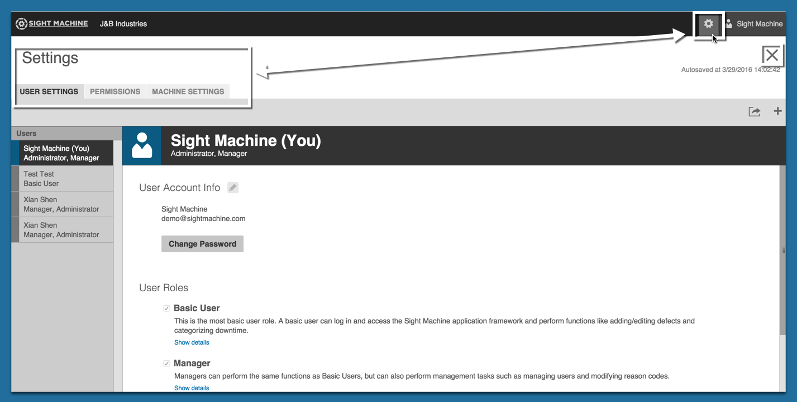

# Settings

 On the Settings screen you configure user settings, user permissions, and machine settings. 
 
 Open the Settings screen by clicking the Gear icon in the top right corner of Sight Machine.
 
 
 
 The Settings screen default display is the User Settings tab in focus. 
 
 
 Click the X icon in the upper right corner to close the Settings screen and return to the OEE Tab.