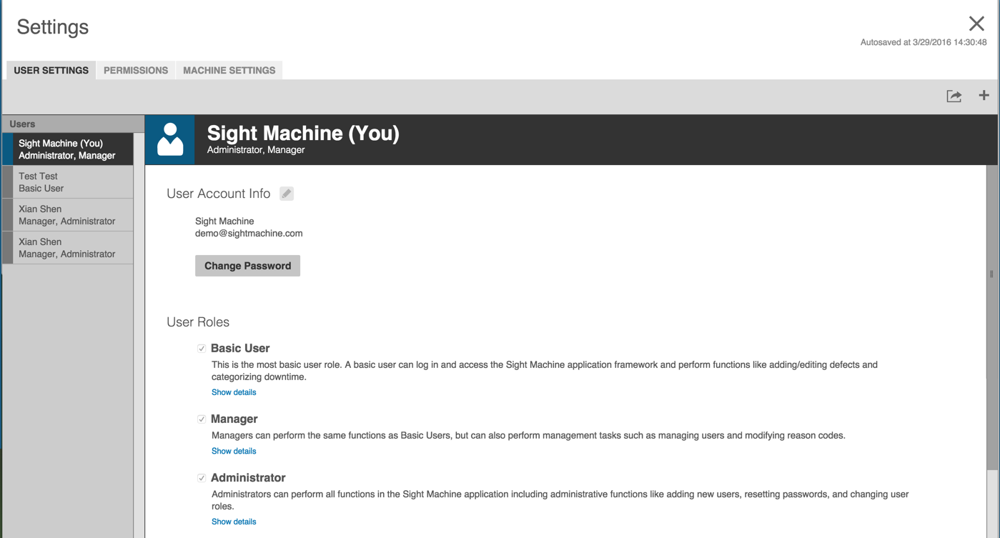
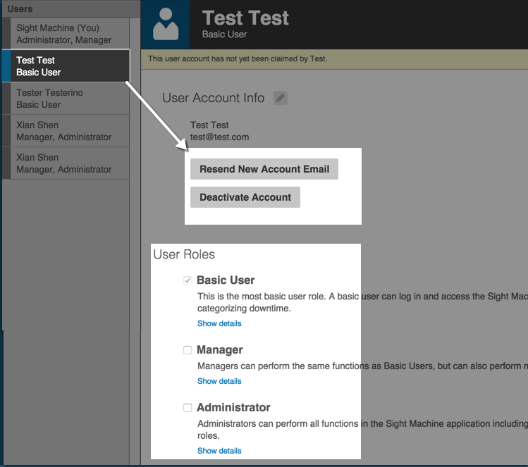

# User Settings Tab

On the User Settings Tab is where you set up and manage new Sight Machine users.

Previously-configured users appear in the far left Users pane. Clicking each user in the Users pane displays their user account information.

**Configuring a New User**

1. Click the + icon in the upper right corner of the screen to open the Add New User dialog box.

  

2. Enter the user's information in the required fields and select a role\/roles. The Basic User radio button is automatically selected and disabled to set minimum permissions for any new user.

3. Click Save to close the Add New User dialog box. 
  * The new user displays in the Users pane. 
  * An email is automatically sent to the user to prompt them to set their password.

**Changing User Settings**

Click a user in the Users pane to select them and display their account settings.

* If the user hasn't set up a password you can click Resent New Account Email to resend the email prompt.
* Click Deactivate Account to deactivate a user account. You'll be prompted to confirm the deactivation. The Deactivate Account button toggles to display as the Activate Account button. 
* Add user roles to a user account by selecting the check boxes for the role\(s\). The changes save automatically.

