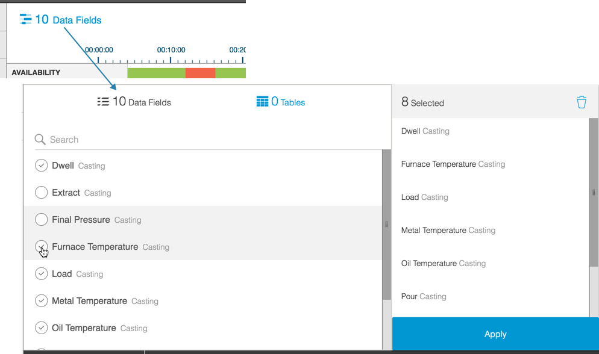

# Filtering Timeline View

  To filter the Timline Tab display:
  
  1. In the Filter Bar:
   
   * Select an asset using the Asset Selector
   * Select a date using the Date Picker
   
      **Note:** The Timeline displays a 24-hour period. The Date Picker allows you to pick one day.
  
     The Timeline view refreshes to reflect your filter selections.
   
  2. Click the Data Field icon to open the Accumulator to remove or add data fields to the Timeline tab.

    
  
  3. Click Apply to close the Accumulator and refresh the Timeline Tab with your data field selection.