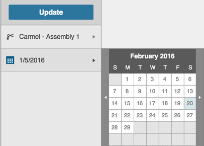
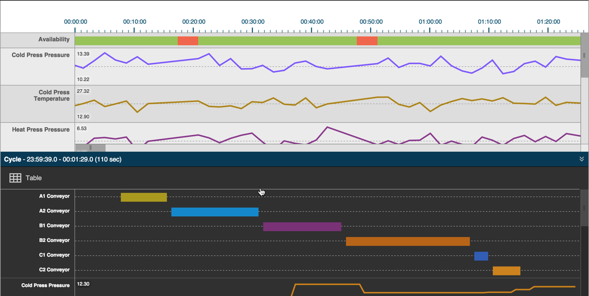
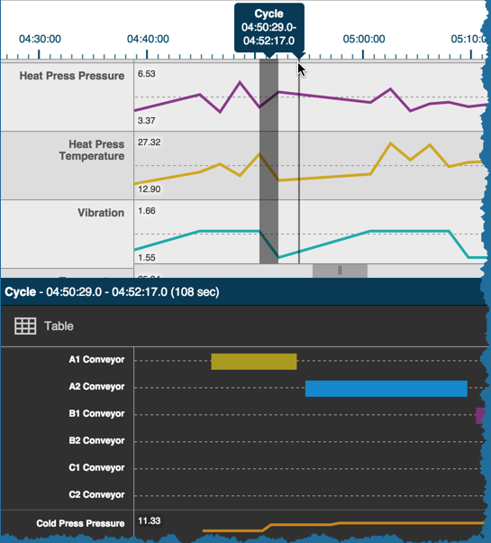

# Unique Timeline Tab Navigation

To view machine data on the Timeline Tab, you will need to tell Sight Machine for which machine and for which day you to want to view data.

1.  In the Filter Bar, select an asset (by location or by time) and  a date from the Date picker.

2.  Click Update to view data for the selected machine and date range.

   
   The timeline displays in horizontal two panes, stacked one on the other. The top pane shows machine operation or downtime in 10-minute increments for the 24-hour cycle. The lower pane shows machine cycle breakdown for a small subset of the 24-hour cycle, based on your click-selection in the top pane. 
  
  **Note:** You can click the middle-bar's double-down arrow icon to close the lower pane and display the top pane view alone.
  
  
  
 * Click and drag the horizontal and vertical slider bars on the top pane to see machine availability for the cycle. On the lower pane, click and drag the vertical slider bar to see the different cycle element measurements.
 * Hover over the Availability row in the top pane to see machine running time and down time.
 * Click on the top cycle measurement bar to select a specific moment in the cycle. The lower pane shows the machine detail for that cycle time.
 
   

   **Note:** In the lower pane, you can click the Table icon to display the Data Tab with more detailed information.
  
 