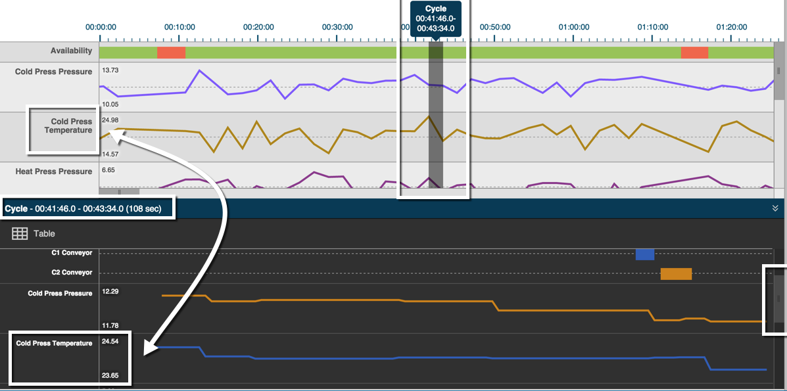

# Viewing Cycle Breakdown

 The Timeline Tab's lower pane shows a break down of the cycle in specific time chunks. Use the following steps to view cycle details.
 
 1. Select the asset and day you want to view from the Filter Bar, and click Update to view the timeline.
 2. Click the timeline above the top pane to select a specific time interval. The Cycle time appears as pop-up text above the timeline, and a gray, vertical bar denotes your selection on the spectrum.

 3. In the lower pane, use the vertical scroll bar to view the line graphs for each measure. Note the maximum and minimums for each measure that precedes each line graph.