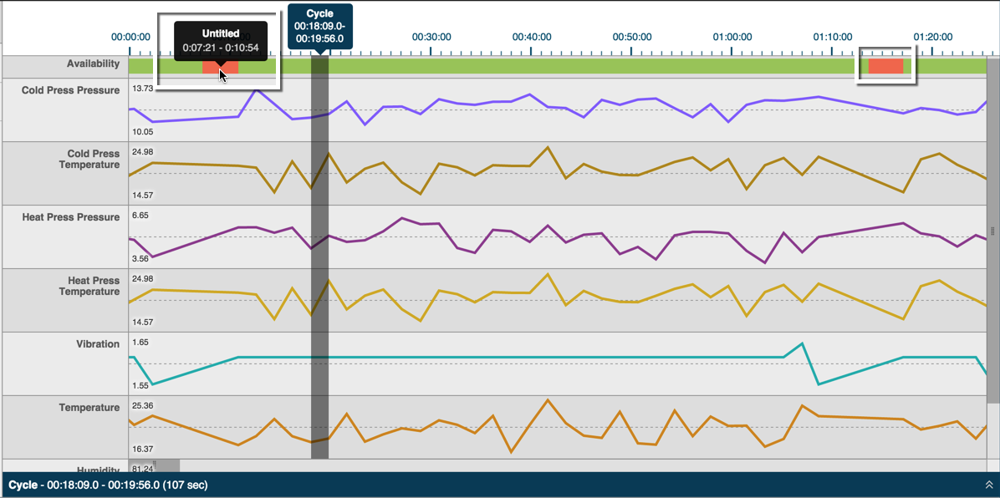

# Viewing Cycle Downtime

 Cycle downtime displays in the top pane of the Timeline Tab as red-shaded sections in the Availability row.
 
 
 Hovering over the red-shaded downtime displays pop-up text with the beginning and ending downtime range.
 
 